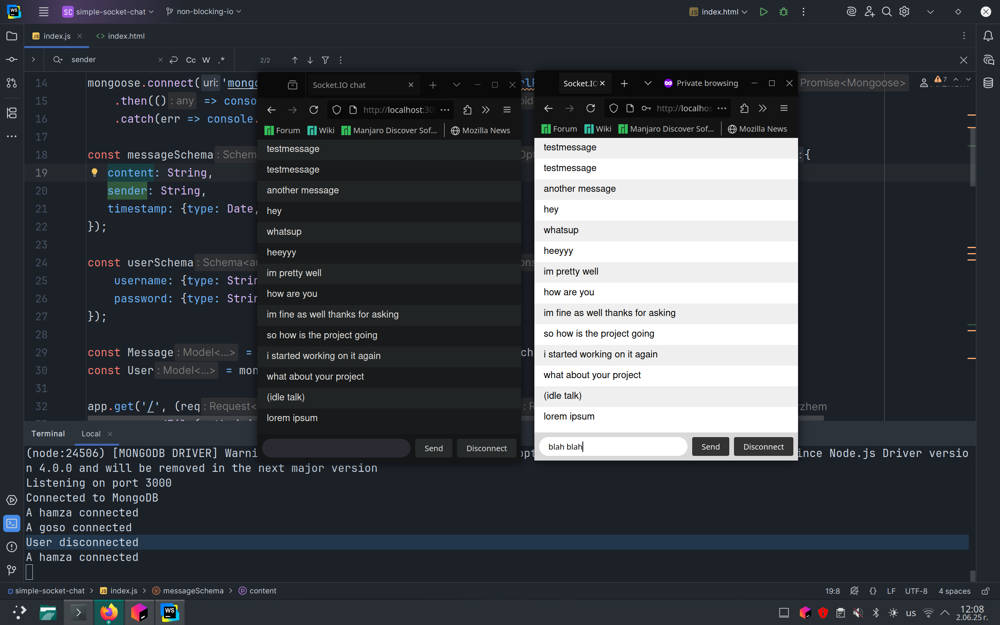

A minimalist real-time web chat application, optimized for high concurrency and stable performance under simultaneous load.


`Node.js` is built on non-blocking I/O and the [`Socket.IO`](https://socket.io/docs/v4/) library has built-in management for reconnection attempts, connection, disconnection events and handling multiple clients simulatenously, but they don't handle the following from the get-go:

- **State management:** who sent what, message history, queues of tasks, user roles or routing logic and if something needs to be processed in order,


- **Long-running CPU tasks:** tasks like image processing, heavy calculations and compressing files can still block the `Node.js` event loop,

- **Race conditions / deadlocks in shared state:** `Node.js` avoids true race conditions thanks to the event loop, but once you do database calls or external I/O you're at risk again. 

In this project, I implement these features and create a real-time web chat application specifically optimized for high concurrency.

The current version is just a preliminary draft, but if you want to try it out with your friends you can use [`ngrok`](https://ngrok.com/) to create a secure tunnel to your localhost, generating a public URL they can use to access the chat.





### Getting Started
#### Prerequisites
- [`Node.js`](https://nodejs.org/en/download) v18+
- [`npm`](https://docs.npmjs.com/downloading-and-installing-node-js-and-npm) or [`yarn`](https://classic.yarnpkg.com/lang/en/docs/install/#debian-stable)
- [`MongoDB`](https://www.mongodb.com/docs/manual/installation/)

#### Installation & Running
You can get the files by either downloading the .zip of the repository or cloning it locally using Git:
```
    git clone https://github.com/Arzhem/socket-chat.git
```

Before starting the web server you have to start a local MongoDB server. If you use Linux, run the local server by running the following command:
```
   sudo systemctl start mongodb 
```
After making sure that MongoDB is active navigate to the local repository folder and start the server:
```
    node server.js
```

The application should now be accessible in your web browser at [http://localhost:3000](http://localhost:3000).
